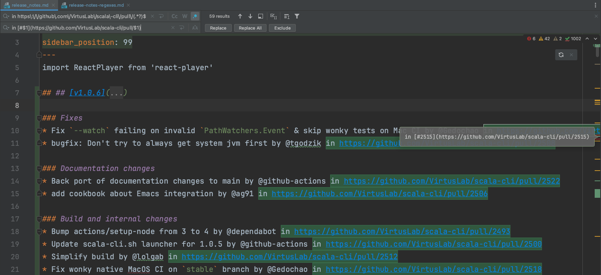

# Regexes for preparing Scala CLI release notes

When auto-generating release notes from the GitHub UI, the notes will contain GitHub-idiomatic @mentions of users, 
links to PRs, issues, etc. Those have to then be swapped out for the corresponding Markdown syntax to be rendered 
correctly on our documentation website.
What's worse, the GitHub syntax has to be preserved in the GitHub release description, as using the full Markdown 
syntax required by our website breaks the GitHub mouse hover magic.

To make the process of switching the syntax faster, you can use the following regexes.

Do keep in mind that IDEA IntelliJ allows to automatically apply regexes when replacing text, so you can use that to
fix the release notes on the fly.

## PR link
Find: `in https\:\/\/github\.com\/VirtusLab\/scala\-cli\/pull\/(.*?)$`  
Replace: `in [#$1](https://github.com/VirtusLab/scala-cli/pull/$1)`

## Contributor link
Find: `by @(.*?) in`  
Replace: `by [@$1](https://github.com/$1) in`

## New contributor link
Find: `@(.*?) made`  
Replace: `[@$1](https://github.com/$1) made`

## No GH contributor link
Find: `by \[@(.*?).\(.*\) in`  
Replace: `by @$1 in`