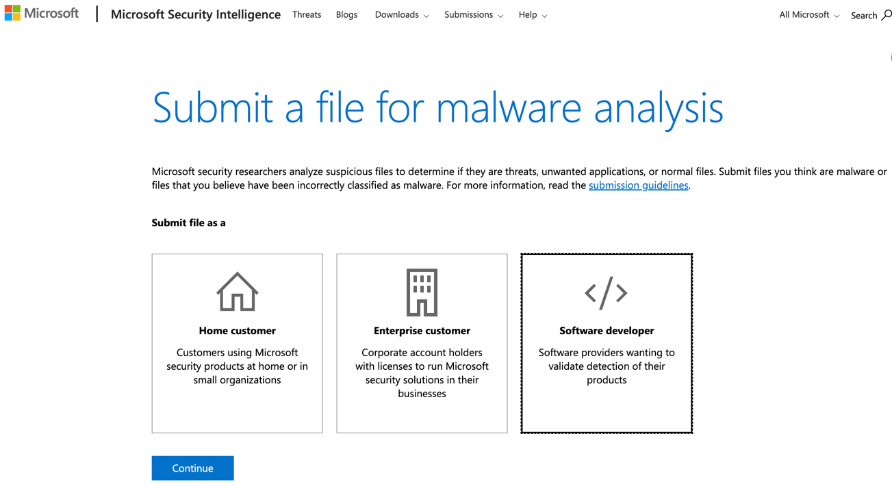
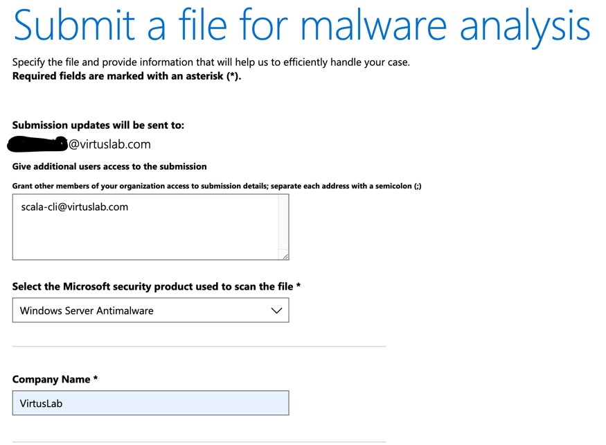
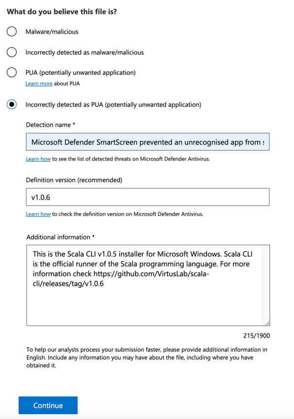
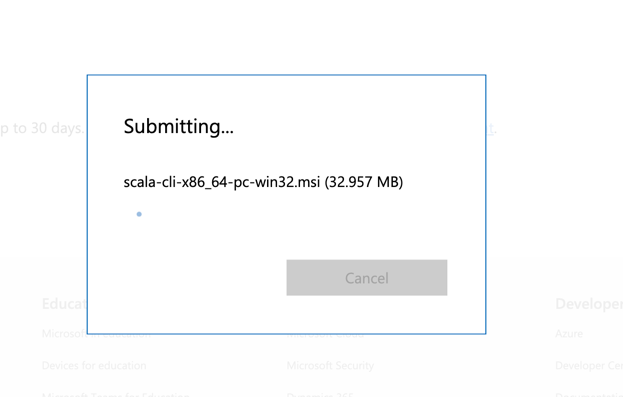
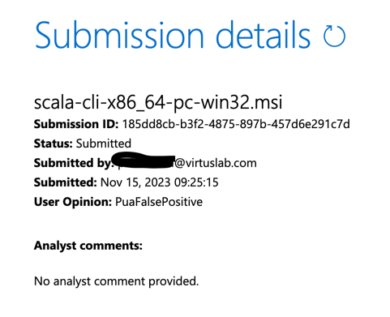

# Microsoft anti-malware analysis

As new Scala CLI are (wrongly) assumed to be PUA (potentially unwanted applications) by Microsoft Defender SmartScreen 
on Windows, we need to submit them for analysis to Microsoft after release.

Note: the analysis may take time, and the results may not be immediately available. 
Sometimes it's days, sometimes it's weeks.
It may even occur that the new release gets analysed while the previous one is still in the pipeline 
due to reasons unknown to us. 
As those eventually do pull through, we can't do much about it.

## Submitting a file for analysis

After going through the [release procedure](release-procedure.md), we need to submit the MSI installer 
and the EXE launcher for analysis:
  - [ ] Download the `scala-cli-x86_64-pc-win32.msi` and upload it using [this service](https://www.microsoft.com/en-us/wdsi/filesubmission).
  - [ ] Download the `scala-cli-x86_64-pc-win32.zip`, extract it and upload `scala-cli.exe` using [the same service](https://www.microsoft.com/en-us/wdsi/filesubmission).
You will need to log in using your company account authorised by the VirtusLab IT division. 
If you don't have one or if the one you do have doesn't have the right permissions
(even though you are a maintainer of the Scala CLI repository), be sure to reach out to IT.

## Submission form

When reaching https://www.microsoft.com/en-us/wdsi/filesubmission, you will be presented with a form to fill out.



Submit file as a `Software Developer` and click continue.



Make sure to grant your team members access to the submission by adding their emails 
in the `Give additional user s access to the submission` section.
You can find the current Scala CLI team listed in the [Scala CLI publish module definition](../../project/publish.sc)
You might also want to add the `scala-cli@virtuslab.com` group email address.

Select `Windows Server Antimalware` as the security product used to scan the file.
Fill in `VirtusLab` as the `Company Name`.



#### What do you believe this file is?
Select `Incorrectly detected as PUA (potentially unwanted application)`.

#### Detection name 
Microsoft Defender SmartScreen prevented an unrecognised app from starting.

#### Definition version
The version number for the Scala CLI release.

#### Additional information
When uploading the installer (`*.msi`), paste the following, fixing swapping out the version number and release link accordingly.
```text
This is the Scala CLI v<version number> installer for Microsoft Windows. 
Scala CLI is the official runner of the Scala programming language. 
For more information check https://github.com/VirtusLab/scala-cli/releases/tag/v<version number>
```

For the launcher (`*.exe`), use the (almost identical) following text:
```text
This is the Scala CLI v<version number> launcher for Microsoft Windows.
Scala CLI is the official runner of the Scala programming language.
For more information check https://github.com/VirtusLab/scala-cli/releases/tag/v<version number>
```

Click continue.



You might have to verify that you're a human, after which the submission should proceed.



Double-check the submission details are correct, ending the process.
